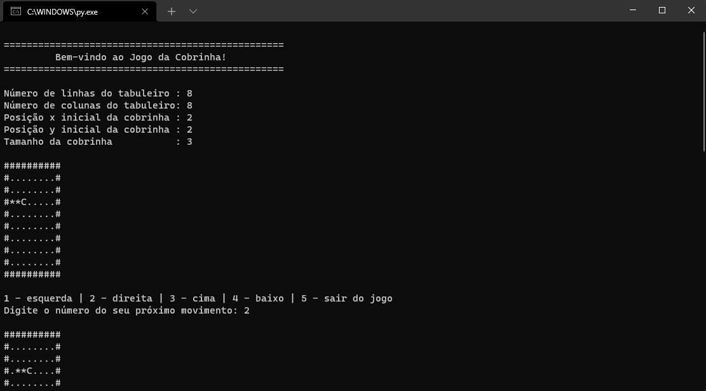
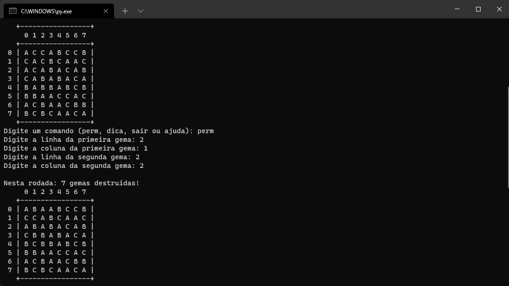
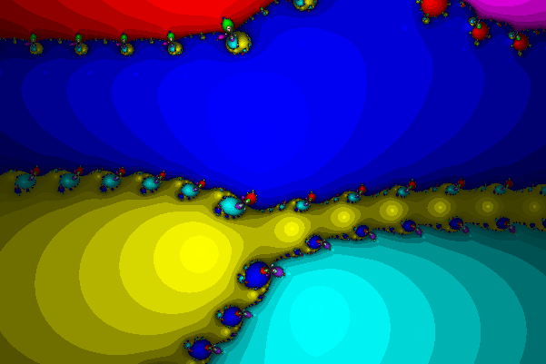
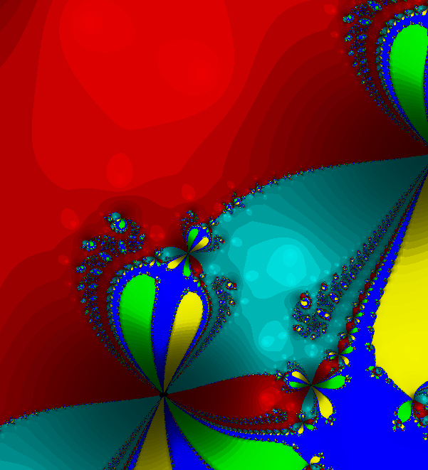

# Intro-Comp-MAC2166-2017

-----

This repository is focused in presenting 3 simple projects developed in the course "Introduction to Computing" of Polytechnic School of University of São Paulo, 2017.

## EP1 (Snake game):

The first project is a terminal snake game. Image bellow:

## EP2 (Bejeweled like game):

The second project is a Bejeweled Terminal game where the player must input "perm" for permutation, "dica" for a tip, "sair" for exit or "help" for instructions. After typing "perm", the player must give coordenates of the board.

## EP3 (Dynamic behavior of Newton Method)

The third project creates .ppm files (a type of image file) from mathematical equations using the newton method and complex numbers.

